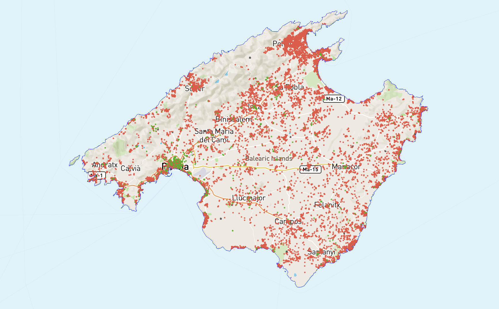
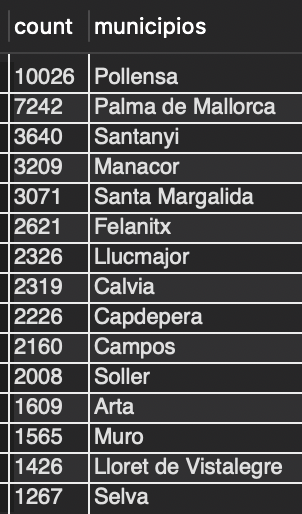
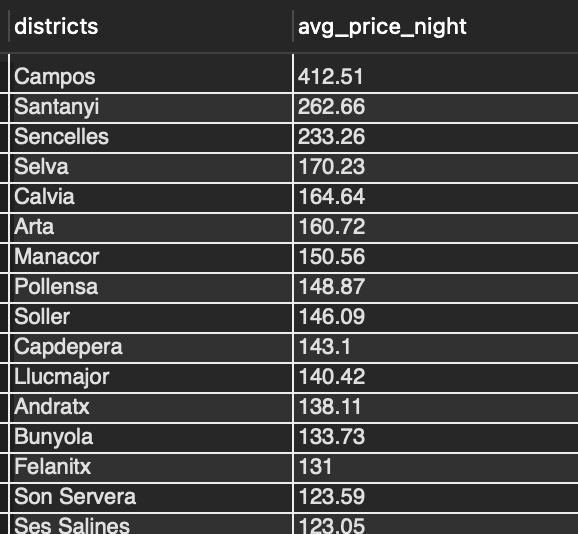
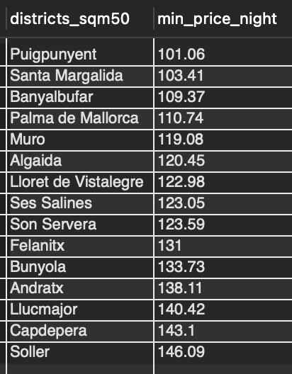
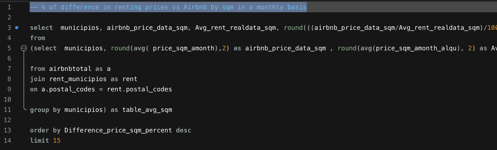
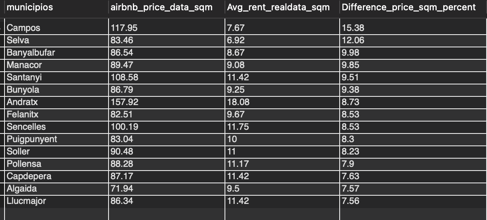
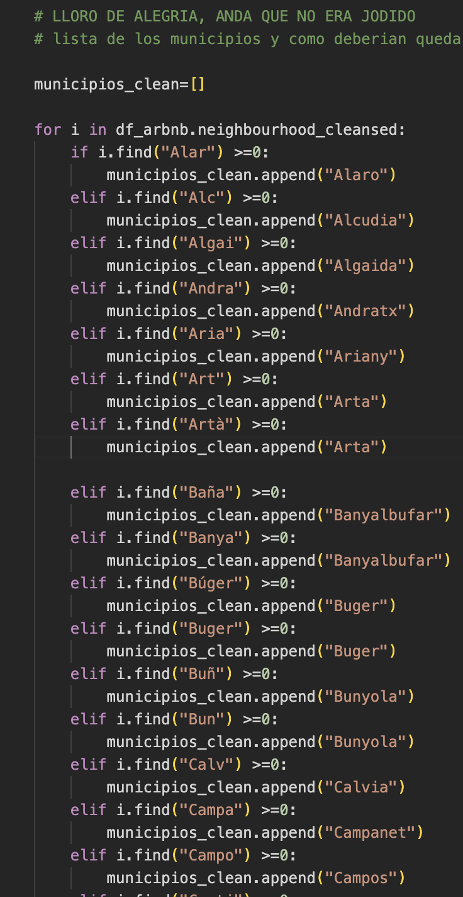

# Project: ETL

## INTRO
  ### Airbnb vs rent prices in Mallorca:

My week proyect is about finding out if Airbnb renting does affect real renting prices by square meters in a historical data.

The focus is in the touristic area of Mallorca, Spain. To be able to start digging in a smaller dataframe.

The idea behind is to be able in the future to find a correlation -that might be for later porpoise - since Mallorca is breaking records each year.
The population of Mallorca is worried about the increase of tourism in specific months form June to August. Since affects their normal day a day in the island.

Is important to understand that this analysis is not meant to criticize tourism or either Airbnb, is meant for playing around with data and reach a neutral conclusion.

I might not arrive to the final conclusion since is extensive analysis for a weekend.

## Coclusions I reached so far! 

DATA OF AIRBNB IS BASED ON THE MONTHS OF MARCH & SEPT 2021, AND JUNE & SEPT 2022 all together.

- Q1 -- Districts with mosth airbnb

 

- Q2 -- Top 15 districts average prices x night - 50sqm only

- Q3 - Top 15 districts minimun average prices x night -50sqm

- Q4 -- % of difference in renting prices vs Airbnb by sqm in a monthly basis

- ERD 

- Outliers in Price and Avg.Price

+

## Technical Requirements - which I also followed for the proyect:

- A) Grab DataSources that have enough data regarding Airbnb and the renting prices in the last years
  - I reached a good source for Airbnb: http://insideairbnb.com/get-the-data
  - Fought my way through scrapping data for the renting prices in all the districts of Mallorca : https://realadvisor.es/es/precios-viviendas/provincia-baleares
  - Found a way for this data to be connected in SQL with primary and foreing keys using the *Postal codes of each district * from wikipedia

- B) This proyect is meant to force us to use DB, APIS or Scrapping ourways to the data from 3 different sources, whichever most convinient
- C) Is also meant for us to do all work from previous weeks
  - Analyzing the Data
  - Cleaning the Data ( dups, strings, types, nulls, n/a etc)
  - finding Outliers
  - Putting together the data and do some calculations with new columns if needed
  - Upload to SQL and dig around with Queries to find the answers ( join, groupby, etc)

## Biggest achivements

- A) I been quite impress by how I managed to jump over new issues, errors etc. I was able to solve all of them and understand the errors.
- B) I managed to do some precious loops in order to keep all district names homogeneous - gigantic next time will focus on writting functions.
       
    - There were different issues with district names, like spanish version, catalonian version and accents
    - I had to keep them equal in all the three different tables in order to do proper analysis

- C) Managed to include the postal codes in the airbnb table for each specific district
- D) Managed to upload to SQL, ERD and do some cool Queries to find some answers

## Biggest F*ups

 - A) Find out some nulls, they avoided me, also affected the first SQL Workbench upload
 - B) Forgot to look for Outliers, too much time worried for knowing if i was going to be able to do all steps with my okeish python skills, time is cruel

 - 

 - C) Loosing my weekend sitting down, i hope to get a good job. At least I Had fun and prove myself i could manage all alone!!!

## Some Thoughts

- I was to quick with the analysis, is sad that I had to be too fast for it to manage some results
- Analyisis is always the priority !!! 
- More confident with Python! I was very worried i would not manage to do some complicated stuff
- Finding resources was exhausting since most times was limited or not complete (the usual in general)
- I requested APIS to Idealista.com I hope they send them and to a Mallorquinian govermnet database for all the ETV( legal turistic renting aparments)
- Wished I had more time to fool around with Data Analysis and create some Graphics on the dataframes.

Cheers and thanks for reading! 

* [Python Functional Programming How To Documentation](https://docs.python.org/3.7/howto/functional.html)
* [Python List Comprehensions Documentation](https://docs.python.org/3/tutorial/datastructures.html#list-comprehensions)
* [Python Errors and Exceptions Documentation](https://docs.python.org/3/tutorial/errors.html)
* [StackOverflow String Operation Questions](https://stackoverflow.com/questions/tagged/string+python)
